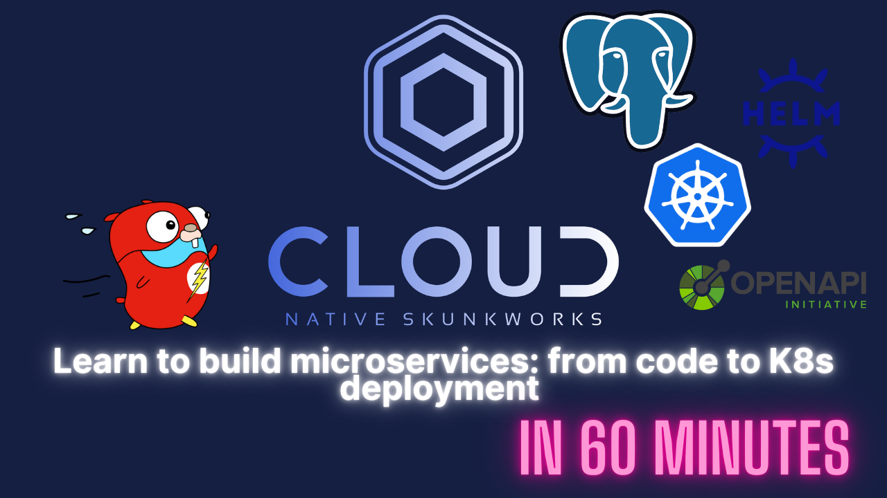

[](https://www.youtube.com/watch?v=unRRnOfxa0s)

This is the companion repository with some sample code as used in the video. It has working code for uploading and retrieval of movies. _Why not write the rest?_


### Setup

- Connect to a local kubernetes cluster
- Run the postgres installer `./scripts/install-postgres.sh`
- Either run the API locally or push your own docker image and modify the helm chart

## Post a movie

```
curl -X POST http://localhost:8081/movie -H 'Content-Type: application/json' -d '{
    "title": "Avengers: Age of Ultron",
    "year": 2016,
    "cast": [
      "Robert Downey, Jr.",
      "Chris Evans",
      "Chris Hemsworth",
      "Mark Ruffalo"
    ],
    "genres": [
      "Action"
    ]
}'
```

## Retrieve a movie

```
curl localhost:8081/movies/year/2016
```

## How to connect psql

```
sudo apt update

sudo apt install postgresql postgresql-contrib

sudo service postgresql start

sudo -i su postgres

postgres@codespaces- createuser --interactive

Output
Enter name of role to add: app
Shall the new role be a superuser? (y/n) y

createdb movie

sudo adduser app

psql -c "ALTER USER app WITH PASSWORD 'your_password';"

sudo su app
psql
psql -d movie